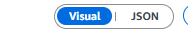
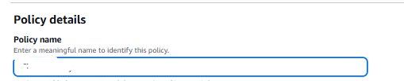
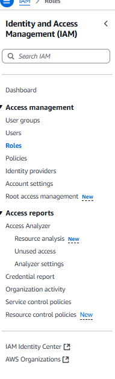
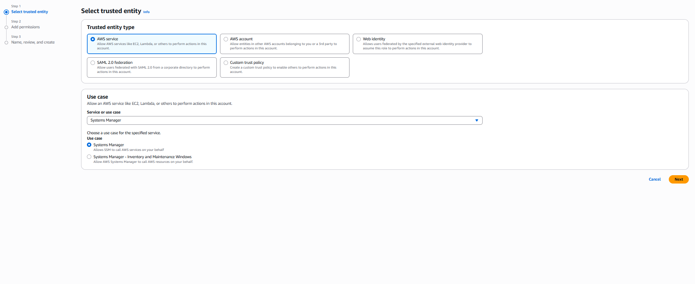
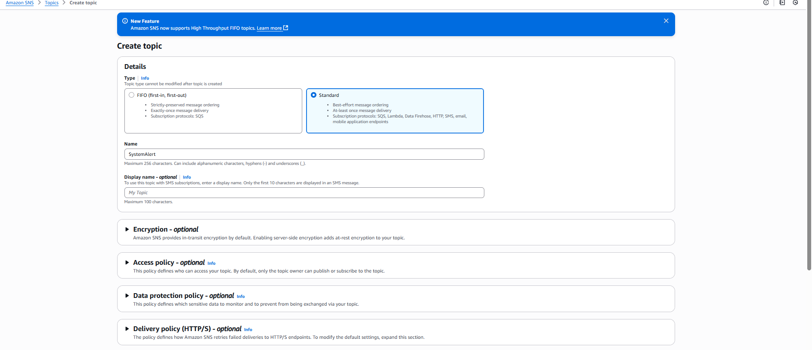
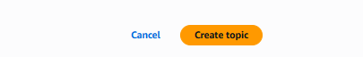

# Set up AWS Configuration with SNS text to be notified about any security changes to AWS Configuration.

## Full Step-by-Step guide with snapshots to describe and illustrate how AWS Config is set up with SNS text notifications.

### This project demonstrates how AWS Config is configured and how to set up SNS notifications via text message to be sent when an AWS Config rule is triggered.  In this project, we will be covering how to:
* Configure AWS Config with preinstalled rules to record all changes and to proactively enforce security actions on newly created EC2 instances
* Set up an SNS email notification to receive an email if and when an EC2 instance change takes place
  

#### Instructions on how to Remediate a Security Group that meets Non-Compliant criteria via rules set up in AWS Config

Create IAM Role to attach the remediation in AWS Config:

*Search for IAM(in the top search box AWS)

*Select Policies from the Left Hand Options

*Select Create Policy 

* Click on the JSON tab in the policy editor

* Insert the code I illustrated( in below photo)  

*Click Next 

Give your policy a name and click Create Policy

* Select Roles>

*Select Create Role>

Select "Systems Manager" Use case and click Next> > 

Give your Role a name  

  
 Click Create Role. 
  

* Search for and select the policy name that I gave in the previous step, and click Next

* Click on the role that you just created and copy your ARN that is located in the summary. (We are going to need the ARN to setup a future part.)
 

  

 
        
  For AWS Config setup:
* Select AWS Config(in the top search box AWS)

 *Select Rules from the left-hand options

 

*From the Specify rule type page type security group in the AWS Managed Rules search box and select the option that begins with Decription = Checks if security groups restrict incoming traffic to restricted ports............. >Select the option that appears and click Next.

 

 * Type a name to give the newly created rule in the details section

   
*Set Frequencey to 1 hour in Evaluation Mode. Click Next Near the bottom.

* Click next at the bottom of the page

 
 

* Select Save at the bottom of the Review and Create Page. 

*  Go back to the Rules Page and select the Rule that You Just Created(Select circle to left of the crossed-out name.)

*  

*  Click the Actions Button in the top Right Corner and select Manage Remediation

  

*  On the Manage Remediation Page, Select Automatic Remediation under "Select Remediation Method." Select AWS-DisablePublicAccessForSecurityGroup under "Remediation Action Details."

* 

*  Select Group ID from the "Resource ID parameter">
*
* 

*  Paste the ARN (Copied from Earlier) in the box to the right of "AutomationAssumeRole", then click Save Changes.

Create the Security Groups for the AWS Configurations

*Search for and select EC2 (in the top searchbox AWS)

*Select Security Group from the left options bar

 

Select the Create Security Group Tab

On the Create Security Groups Page, give your Security Group a name and a Description under in the "Basic Details Box">  Create 2 rules in the Inbound rules box> 

Rule 1) Select SSH under type and Anywhere IPV4 under Source  
Rule 2) Select All Traffic under type and Anywhere IPV4 under Source then select Create Security Group on the bottom 

Create an SNS email to receive an email notification when the above rule(s) are triggered:

* Select SNS(in the top search box)

* Select Topic from the left-hand options, followed by Create Topic>

* On the Create Topic page, Select Standard and give your topic a name in the "Details" Section.

  

* Select Create topic at the bottom.

 

* Navigate to Subscriptions > Create Subscription. In the Create Subscription form, select the previously created Topic ARN from the dropdown, choose Email as the protocol, enter the desired notification email address in the Endpoint field,

* 

* Click Create Subscription.

##### Contribution Policy

This project is not accepting external contributions, including pull requests or feature requests.

It serves as a personal archive of my learning journey in applying foundational concepts in software development and version control. Active development is not ongoing, and external changes will not be integrated.

Thank you for your understanding.

    
