# Set up AWS Configuration with SNS text to be notified about any security changes to AWS Configuration.

## Full Step-by-Step guide with snapshots to describe and illustrate how AWS Config is set up with SNS text notifications.

### This project demonstrates how AWS Config is configured and how to set up SNS notifications via text message to be sent when an AWS Config rule is triggered.  In this project, we will be covering how to:
* Configure AWS Config with preinstalled rules to record all changes and to proactively enforce security actions on newly created EC2 instances
* Set up an SNS email notification to receive an email if and when an EC2 instance change takes place

####Instructions on how to Remediate a Security Group that meets Non-Compliant criteria via rules set up in AWS Config
Create IAM Role to attach the remediation in AWS Config:

Search for IAM (in the top search box AWS)

 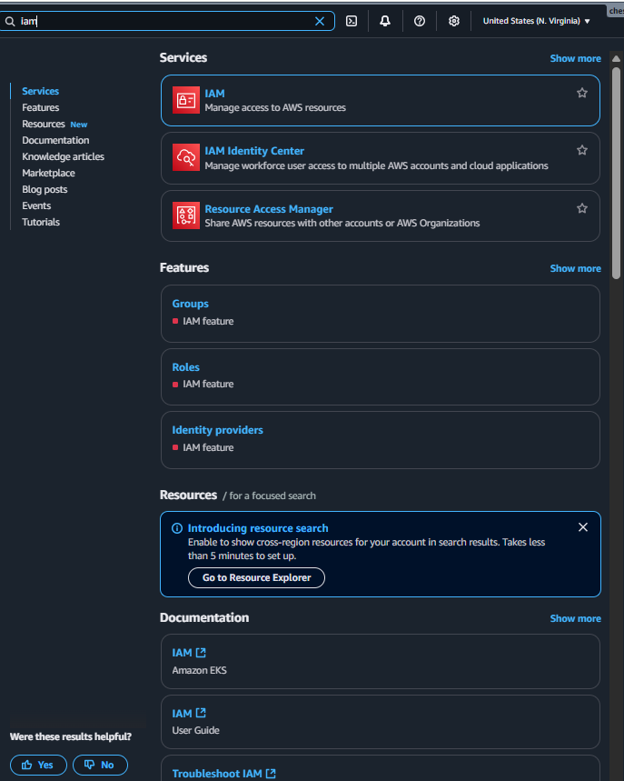 

Select Policies from the Left Hand Options

 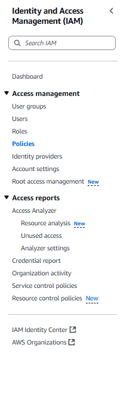 

Select Create Policy

 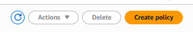 

Click on the JSON tab in the policy editor

  

Insert the code I illustrated (in below photo)

 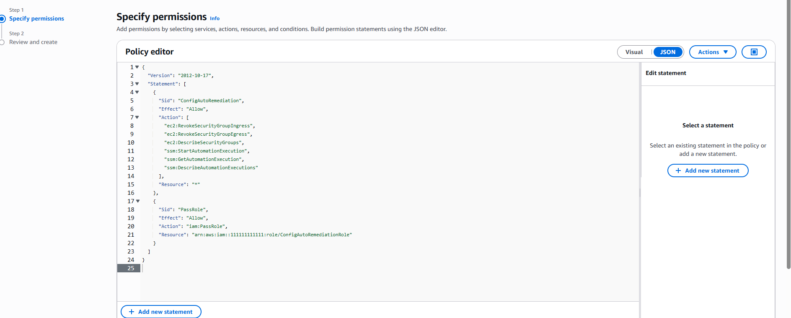 

Click Next

  

Give your policy a name and click Create Policy

 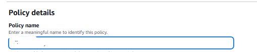 
 
  

Select Roles

 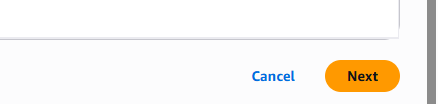 

Select Create Role

 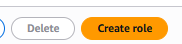 

Select "Systems Manager" Use case and click Next

  

Give your Role a name

 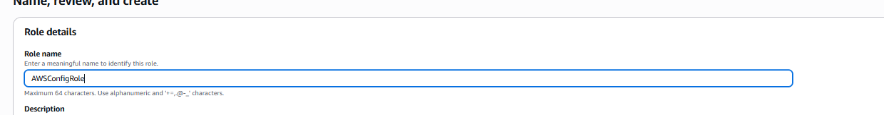 

Click Create Role

 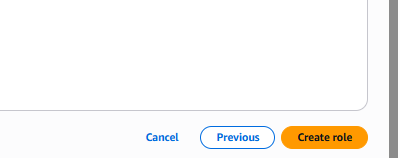 

Search for and select the policy name that you gave in the previous step, and click Next

  

Click on the role that you just created and copy your ARN from the summary (we’ll use this later).

 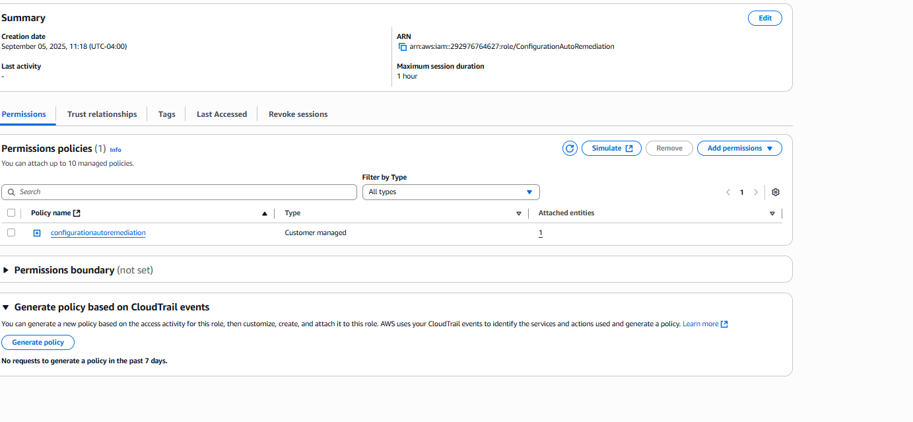 

For AWS Config setup:

Select AWS Config (in the top search box AWS)

 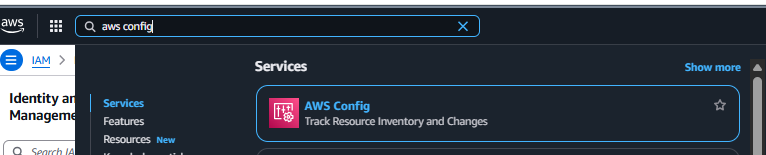 

Select Rules from the left-hand options

 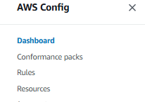 

From the Specify rule type page, type security group in the AWS Managed Rules search box.
Select the option that begins with "Checks if security groups restrict incoming traffic to restricted ports..." and click Next.

  

Type a name to give the newly created rule in the details section

 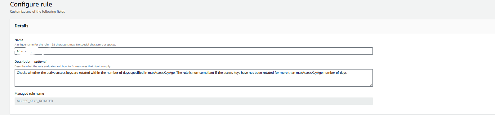 

Set Frequency to 1 hour in Evaluation Mode. Click Next near the bottom.

 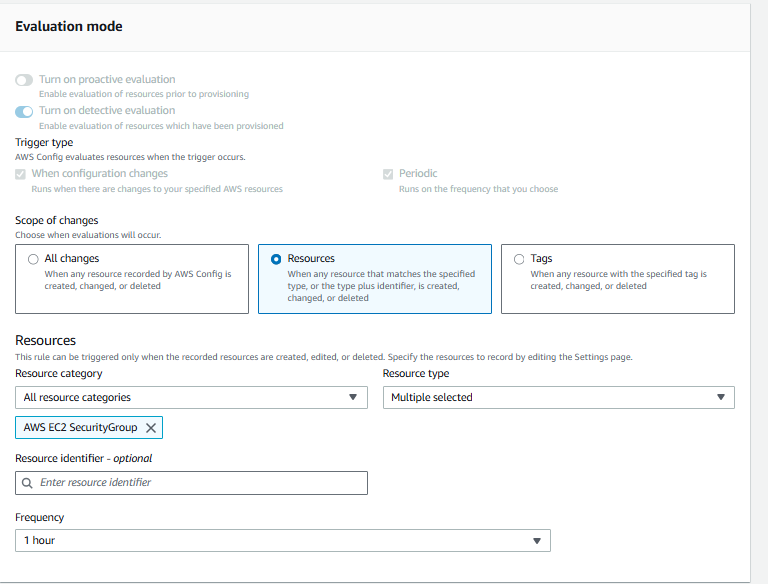 

Click Next at the bottom of the page

 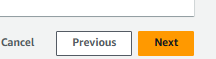 

Select Save at the bottom of the Review and Create Page

  

Go back to the Rules Page and select the Rule that you just created

 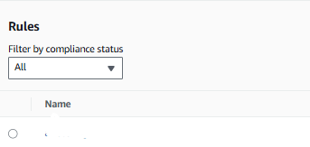 

Click the Actions Button (top right) and select Manage Remediation

  

On the Manage Remediation Page:

Select Automatic Remediation under "Select Remediation Method".

Select AWS-DisablePublicAccessForSecurityGroup under "Remediation Action Details".

  

Select Group ID from the "Resource ID parameter"

  

Paste the ARN (copied earlier) into "AutomationAssumeRole", then click Save Changes

 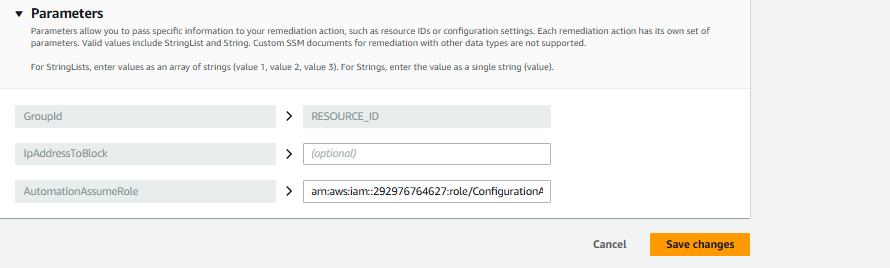 

Create the Security Groups for the AWS Configurations

Search for and select EC2 (in the top search box)

 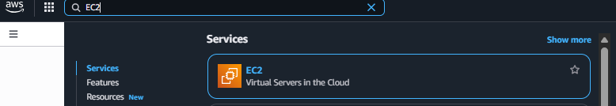 

Select Security Group from the left options bar

 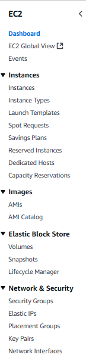 

Select the Create Security Group tab

  

On the Create Security Groups Page:

Give your Security Group a name and description under Basic Details

Create 2 rules in the Inbound rules box

 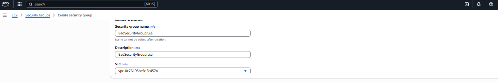 

Rule 1: Select SSH under type and Anywhere IPv4 under source

Rule 2: Select All Traffic under type and Anywhere IPv4 under source

Then select Create Security Group at the bottom

  

Create an SNS email to receive notification when rules are triggered

Select SNS (in the top search box)

 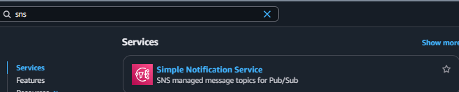 

Select Topic from the left-hand options, then Create Topic

 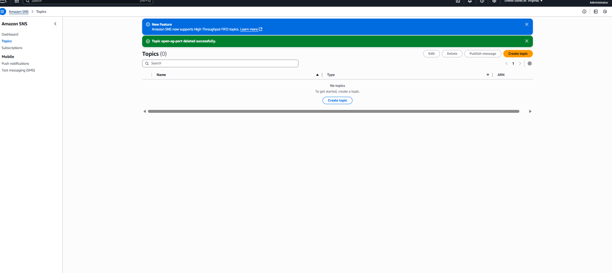 

On the Create Topic page:

Select Standard

Give your topic a name in the Details section

  

Select Create topic at the bottom

  

Navigate to Subscriptions → Create Subscription.

Select your Topic ARN from the dropdown

Choose Email as the protocol

Enter the desired notification email in the Endpoint field

 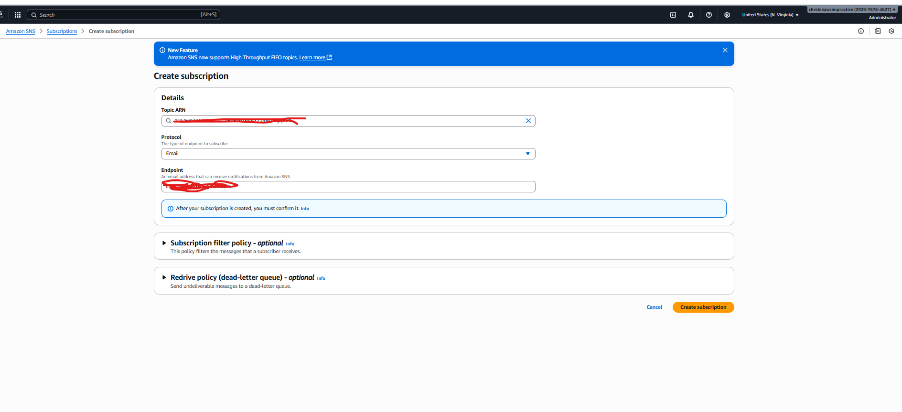 

Click Create Subscription

 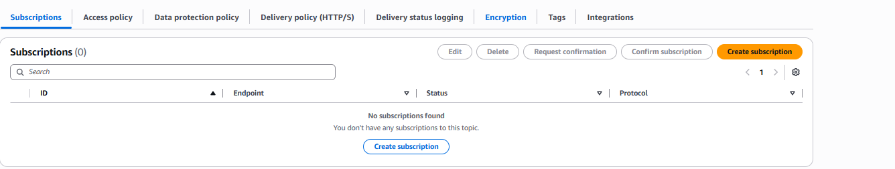 

##### Contribution Policy

This project is not accepting external contributions, including pull requests or feature requests.

It serves as a personal archive of my learning journey in applying foundational concepts in software development and version control. Active development is not ongoing, and external changes will not be integrated.

Thank you for your understanding.

    
